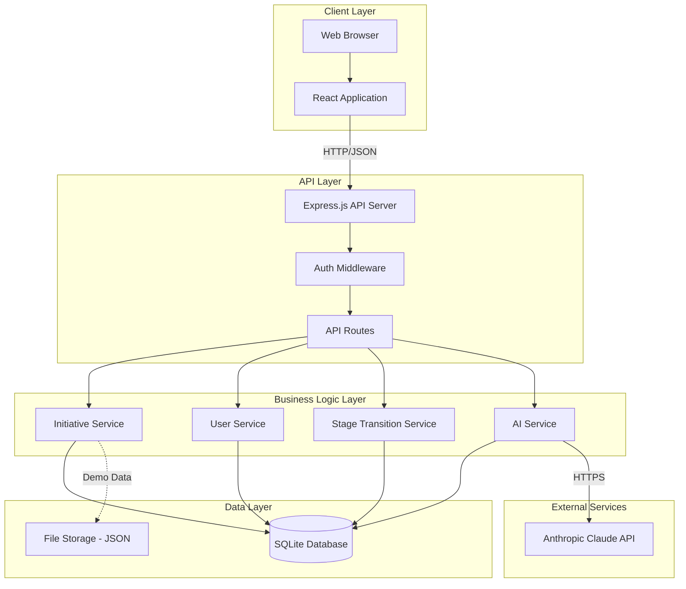
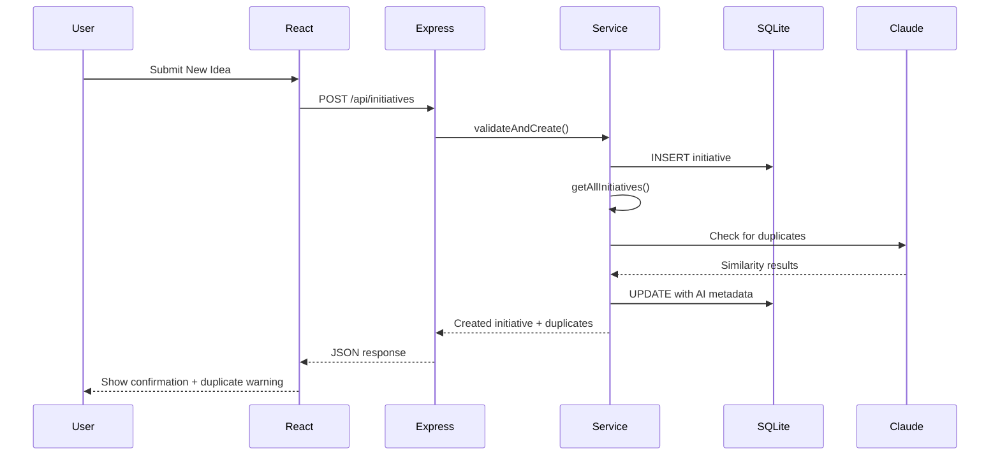
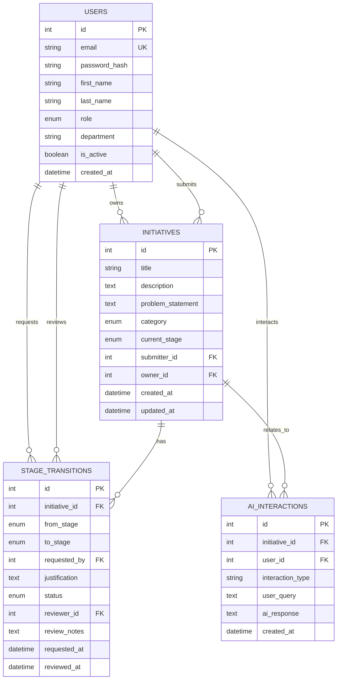
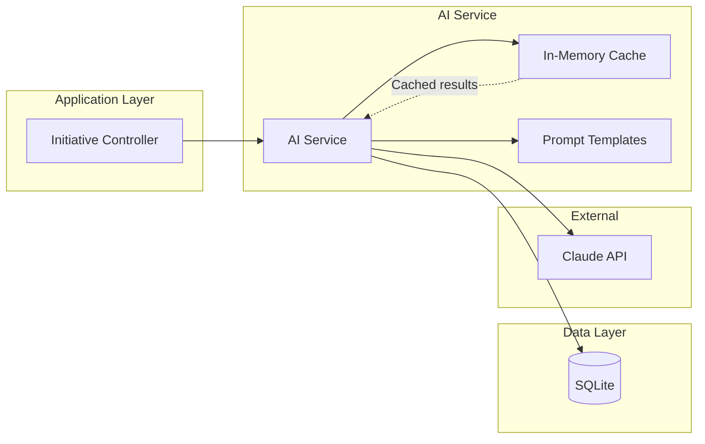
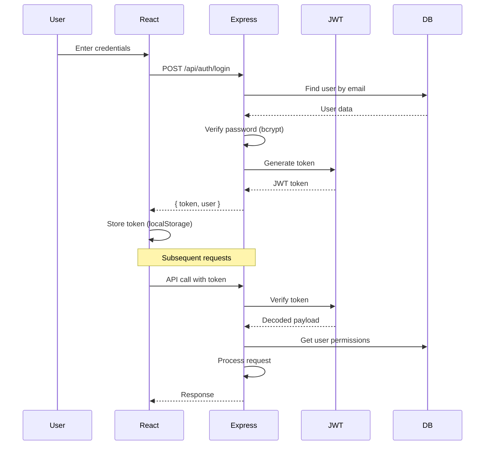

# Solution Architecture - Innovation Lifecycle Manager

## Document Information

**Version**: 1.0
**Phase**: Phase 3 - Technical Architecture
**Scope**: Demo Implementation (12 User Stories, 5 Epics)
**Last Updated**: 2025

---

## Table of Contents

1. [Technology Stack](#technology-stack)
2. [System Architecture](#system-architecture)
3. [Component Details](#component-details)
4. [Data Architecture](#data-architecture)
5. [API Design](#api-design)
6. [AI Integration Architecture](#ai-integration-architecture)
7. [Security & Authentication](#security--authentication)
8. [Development Setup](#development-setup)
9. [Deployment Strategy](#deployment-strategy)

---

## Technology Stack

### Frontend

**Framework**: React 18+
**Why**: Component-based, rich ecosystem, fast development

**UI Library**: Tailwind CSS + Headless UI
**Why**: Rapid styling, no custom CSS needed, accessibility built-in

**State Management**: React Context API + useState/useReducer
**Why**: Sufficient for demo scope, no need for Redux complexity

**HTTP Client**: Axios
**Why**: Simple, promise-based, better error handling than fetch

**Build Tool**: Vite
**Why**: Faster than Create React App, modern, excellent DX

**Additional Libraries**:
- `react-router-dom` - Client-side routing
- `date-fns` - Date formatting
- `clsx` - Conditional CSS classes
- `react-hot-toast` - Notifications

---

### Backend

**Runtime**: Node.js 18+ (LTS)
**Framework**: Express.js
**Why**: Minimal, flexible, well-documented, perfect for API development

**Additional Libraries**:
- `cors` - Cross-origin resource sharing
- `helmet` - Security headers
- `express-validator` - Request validation
- `jsonwebtoken` - JWT authentication
- `bcrypt` - Password hashing
- `dotenv` - Environment variables
- `morgan` - HTTP request logging

---

### Database

**Primary Database**: SQLite3
**Why**:
- ✅ No installation required
- ✅ No admin rights needed
- ✅ File-based (single .db file)
- ✅ Zero configuration
- ✅ Sufficient for demo and small-scale production
- ✅ Can be upgraded to PostgreSQL later without major code changes

**ORM/Query Builder**: Better-SQLite3 + Knex.js
**Why**:
- `better-sqlite3`: Synchronous API, faster than async sqlite3
- `knex.js`: Query builder, migrations, works with multiple databases

**AI/Vector Storage**: In-memory cache + Claude API
**Why**:
- For demo, we don't need a dedicated vector database
- Store initiative text in SQLite
- Generate embeddings on-demand via Claude API
- Cache similarity computations in memory
- If scaling needed later: Add Pinecone or ChromaDB

---

### AI Integration

**AI Provider**: Anthropic Claude API (Claude 3.5 Sonnet)
**Why**:
- Best-in-class for analysis and reasoning
- 200K context window (can analyze all initiatives)
- Excellent at semantic similarity
- JSON mode for structured outputs

**SDK**: `@anthropic-ai/sdk`

**Approach**: Direct API calls (no vector DB for demo)
**Process**:
1. User submits idea
2. Fetch all existing initiatives from SQLite
3. Send to Claude with prompt: "Compare this to existing initiatives"
4. Claude returns similarity scores and explanations
5. Display to user

---

## System Architecture

### High-Level Architecture Diagram



---

### Component Interaction Flow



---

## Component Details

### 1. Client Application (React)

**Structure**:
```
src/
├── components/
│   ├── auth/
│   │   ├── Login.jsx
│   │   └── ProtectedRoute.jsx
│   ├── board/
│   │   ├── KanbanBoard.jsx
│   │   ├── StageColumn.jsx
│   │   └── InitiativeCard.jsx
│   ├── initiatives/
│   │   ├── InitiativeForm.jsx
│   │   ├── InitiativeDetail.jsx
│   │   └── DuplicateWarning.jsx
│   ├── approvals/
│   │   ├── ApprovalList.jsx
│   │   └── ApprovalCard.jsx
│   └── common/
│       ├── Header.jsx
│       ├── Button.jsx
│       ├── Modal.jsx
│       └── Spinner.jsx
├── contexts/
│   ├── AuthContext.jsx
│   └── InitiativeContext.jsx
├── services/
│   ├── api.js
│   ├── authService.js
│   └── initiativeService.js
├── hooks/
│   ├── useAuth.js
│   └── useInitiatives.js
├── utils/
│   ├── constants.js
│   └── helpers.js
├── App.jsx
└── main.jsx
```

**Key Features**:
- Component-based architecture
- Context API for global state (auth, initiatives)
- Custom hooks for business logic
- Service layer for API calls
- Responsive design with Tailwind CSS

---

### 2. API Server (Express.js)

**Structure**:
```
server/
├── src/
│   ├── routes/
│   │   ├── auth.routes.js
│   │   ├── initiatives.routes.js
│   │   ├── transitions.routes.js
│   │   └── users.routes.js
│   ├── controllers/
│   │   ├── auth.controller.js
│   │   ├── initiatives.controller.js
│   │   ├── transitions.controller.js
│   │   └── users.controller.js
│   ├── services/
│   │   ├── initiative.service.js
│   │   ├── user.service.js
│   │   ├── transition.service.js
│   │   └── ai.service.js
│   ├── middleware/
│   │   ├── auth.middleware.js
│   │   ├── validation.middleware.js
│   │   └── error.middleware.js
│   ├── models/
│   │   ├── database.js
│   │   ├── initiative.model.js
│   │   ├── user.model.js
│   │   └── transition.model.js
│   ├── config/
│   │   ├── database.config.js
│   │   └── env.config.js
│   └── utils/
│       ├── logger.js
│       └── responses.js
├── migrations/
│   ├── 001_create_users.js
│   ├── 002_create_initiatives.js
│   └── 003_create_transitions.js
├── seeds/
│   └── demo-data.js
├── app.js
└── server.js
```

**Key Features**:
- RESTful API design
- Layered architecture (routes → controllers → services → models)
- Middleware for auth, validation, error handling
- Database migrations for schema management
- Seed data for demo

---

### 3. Business Logic Services

#### Initiative Service
**Responsibilities**:
- Create, read, update initiatives
- List initiatives by stage, owner, category
- Validate initiative data
- Manage initiative lifecycle

**Key Methods**:
```javascript
class InitiativeService {
  async create(data, userId)
  async findById(id)
  async findAll(filters)
  async update(id, data, userId)
  async findByStage(stage)
  async findByOwner(userId)
}
```

#### User Service
**Responsibilities**:
- User authentication
- User profile management
- Role-based authorization

**Key Methods**:
```javascript
class UserService {
  async authenticate(email, password)
  async findById(id)
  async findByEmail(email)
  async hasRole(userId, role)
}
```

#### Stage Transition Service
**Responsibilities**:
- Request stage transitions
- Approve/reject transitions
- Update initiative stage
- Validate stage transition rules

**Key Methods**:
```javascript
class TransitionService {
  async requestTransition(initiativeId, toStage, justification, userId)
  async findPendingForReviewer(reviewerId)
  async approve(transitionId, notes, reviewerId)
  async reject(transitionId, reason, reviewerId)
}
```

#### AI Service
**Responsibilities**:
- Duplicate detection
- Semantic similarity analysis
- Claude API integration

**Key Methods**:
```javascript
class AIService {
  async checkDuplicates(initiative)
  async findSimilar(initiative, threshold = 0.7)
  async analyzeInitiative(initiative)
}
```

---

## Data Architecture

### Database Schema

#### Users Table
```sql
CREATE TABLE users (
  id INTEGER PRIMARY KEY AUTOINCREMENT,
  email TEXT UNIQUE NOT NULL,
  password_hash TEXT NOT NULL,
  first_name TEXT NOT NULL,
  last_name TEXT NOT NULL,
  role TEXT NOT NULL CHECK(role IN ('EMPLOYEE', 'REVIEWER', 'ADMIN')),
  department TEXT,
  is_active BOOLEAN DEFAULT 1,
  created_at DATETIME DEFAULT CURRENT_TIMESTAMP,
  last_login_at DATETIME
);
```

#### Initiatives Table
```sql
CREATE TABLE initiatives (
  id INTEGER PRIMARY KEY AUTOINCREMENT,
  title TEXT NOT NULL,
  description TEXT NOT NULL,
  problem_statement TEXT NOT NULL,
  category TEXT NOT NULL CHECK(category IN ('TECHNOLOGY', 'PROCESS', 'PRODUCT', 'OTHER')),
  current_stage TEXT NOT NULL CHECK(current_stage IN ('IDEA', 'CONCEPT', 'DEVELOPMENT', 'DEPLOYED')),
  submitter_id INTEGER NOT NULL,
  owner_id INTEGER NOT NULL,
  created_at DATETIME DEFAULT CURRENT_TIMESTAMP,
  updated_at DATETIME DEFAULT CURRENT_TIMESTAMP,
  last_stage_change_date DATETIME,

  FOREIGN KEY (submitter_id) REFERENCES users(id),
  FOREIGN KEY (owner_id) REFERENCES users(id)
);

CREATE INDEX idx_initiatives_stage ON initiatives(current_stage);
CREATE INDEX idx_initiatives_owner ON initiatives(owner_id);
CREATE INDEX idx_initiatives_category ON initiatives(category);
```

#### Stage Transitions Table
```sql
CREATE TABLE stage_transitions (
  id INTEGER PRIMARY KEY AUTOINCREMENT,
  initiative_id INTEGER NOT NULL,
  from_stage TEXT NOT NULL,
  to_stage TEXT NOT NULL,
  requested_by INTEGER NOT NULL,
  justification TEXT NOT NULL,
  status TEXT NOT NULL CHECK(status IN ('PENDING', 'APPROVED', 'REJECTED')),
  reviewer_id INTEGER,
  review_notes TEXT,
  requested_at DATETIME DEFAULT CURRENT_TIMESTAMP,
  reviewed_at DATETIME,

  FOREIGN KEY (initiative_id) REFERENCES initiatives(id),
  FOREIGN KEY (requested_by) REFERENCES users(id),
  FOREIGN KEY (reviewer_id) REFERENCES users(id)
);

CREATE INDEX idx_transitions_status ON stage_transitions(status);
CREATE INDEX idx_transitions_reviewer ON stage_transitions(reviewer_id);
```

#### AI Interactions Table (Optional - for learning)
```sql
CREATE TABLE ai_interactions (
  id INTEGER PRIMARY KEY AUTOINCREMENT,
  initiative_id INTEGER,
  user_id INTEGER NOT NULL,
  interaction_type TEXT NOT NULL,
  user_query TEXT,
  ai_response TEXT NOT NULL,
  created_at DATETIME DEFAULT CURRENT_TIMESTAMP,

  FOREIGN KEY (initiative_id) REFERENCES initiatives(id),
  FOREIGN KEY (user_id) REFERENCES users(id)
);
```

---

### Entity Relationships



---

## API Design

### Base URL
Development: `http://localhost:3000/api`

### Authentication
All API endpoints (except `/auth/login`) require JWT token in header:
```
Authorization: Bearer <token>
```

---

### API Endpoints

#### Authentication

**POST** `/api/auth/login`
```json
Request:
{
  "email": "user@example.com",
  "password": "password123"
}

Response:
{
  "token": "eyJhbGc...",
  "user": {
    "id": 1,
    "email": "user@example.com",
    "firstName": "John",
    "lastName": "Doe",
    "role": "EMPLOYEE"
  }
}
```

**GET** `/api/auth/me`
```json
Response:
{
  "id": 1,
  "email": "user@example.com",
  "firstName": "John",
  "lastName": "Doe",
  "role": "EMPLOYEE",
  "department": "Engineering"
}
```

---

#### Initiatives

**GET** `/api/initiatives`
```
Query params:
  - stage (optional): IDEA, CONCEPT, DEVELOPMENT, DEPLOYED
  - category (optional): TECHNOLOGY, PROCESS, PRODUCT, OTHER
  - owner (optional): userId

Response:
{
  "initiatives": [
    {
      "id": 1,
      "title": "AI-Powered Meeting Scheduler",
      "description": "...",
      "problemStatement": "...",
      "category": "TECHNOLOGY",
      "currentStage": "IDEA",
      "submitter": { "id": 1, "name": "John Doe" },
      "owner": { "id": 1, "name": "John Doe" },
      "createdAt": "2024-01-15T10:30:00Z",
      "updatedAt": "2024-01-15T10:30:00Z"
    }
  ]
}
```

**POST** `/api/initiatives`
```json
Request:
{
  "title": "AI-Powered Meeting Scheduler",
  "description": "An intelligent system that automatically schedules meetings...",
  "problemStatement": "Scheduling meetings across time zones is time-consuming...",
  "category": "TECHNOLOGY"
}

Response:
{
  "initiative": { /* initiative object */ },
  "duplicateCheck": {
    "hasDuplicates": true,
    "similar": [
      {
        "id": 5,
        "title": "Calendar Integration Tool",
        "similarityScore": 0.85,
        "reason": "Both address meeting scheduling with AI"
      }
    ]
  }
}
```

**GET** `/api/initiatives/:id`
```json
Response:
{
  "id": 1,
  "title": "AI-Powered Meeting Scheduler",
  "description": "...",
  "problemStatement": "...",
  "category": "TECHNOLOGY",
  "currentStage": "IDEA",
  "submitter": { "id": 1, "name": "John Doe" },
  "owner": { "id": 1, "name": "John Doe" },
  "createdAt": "2024-01-15T10:30:00Z",
  "updatedAt": "2024-01-15T10:30:00Z",
  "transitions": [ /* history */ ]
}
```

**PATCH** `/api/initiatives/:id`
```json
Request:
{
  "description": "Updated description...",
  "problemStatement": "Updated problem..."
}

Response:
{
  "initiative": { /* updated initiative */ }
}
```

---

#### Stage Transitions

**POST** `/api/transitions`
```json
Request:
{
  "initiativeId": 1,
  "toStage": "CONCEPT",
  "justification": "Completed initial validation, ready for deeper analysis"
}

Response:
{
  "transition": {
    "id": 1,
    "initiativeId": 1,
    "fromStage": "IDEA",
    "toStage": "CONCEPT",
    "status": "PENDING",
    "justification": "...",
    "requestedAt": "2024-01-20T14:00:00Z"
  }
}
```

**GET** `/api/transitions/pending`
```json
Response:
{
  "transitions": [
    {
      "id": 1,
      "initiative": { /* basic info */ },
      "fromStage": "IDEA",
      "toStage": "CONCEPT",
      "requestedBy": { "id": 1, "name": "John Doe" },
      "justification": "...",
      "requestedAt": "2024-01-20T14:00:00Z"
    }
  ]
}
```

**POST** `/api/transitions/:id/approve`
```json
Request:
{
  "notes": "Approved. Good business case."
}

Response:
{
  "transition": { /* approved transition */ },
  "initiative": { /* updated initiative with new stage */ }
}
```

**POST** `/api/transitions/:id/reject`
```json
Request:
{
  "reason": "Need more detail on ROI calculation"
}

Response:
{
  "transition": { /* rejected transition */ }
}
```

---

#### AI Features

**POST** `/api/ai/check-duplicates`
```json
Request:
{
  "title": "AI Meeting Scheduler",
  "description": "...",
  "problemStatement": "..."
}

Response:
{
  "hasDuplicates": true,
  "similar": [
    {
      "initiativeId": 5,
      "title": "Calendar Integration Tool",
      "similarityScore": 0.85,
      "explanation": "Both address automated meeting scheduling using AI technology",
      "recommendation": "REVIEW_BEFORE_PROCEEDING"
    }
  ],
  "analysis": "This idea shows significant overlap with existing initiative #5..."
}
```

---

## AI Integration Architecture

### AI Service Design



---

### Duplicate Detection Flow

```javascript
// Simplified duplicate detection logic

async checkForDuplicates(newInitiative) {
  // 1. Fetch all existing initiatives
  const existingInitiatives = await db.getAllInitiatives();

  // 2. Build prompt for Claude
  const prompt = `
    Analyze this new initiative and compare it to existing initiatives.

    NEW INITIATIVE:
    Title: ${newInitiative.title}
    Description: ${newInitiative.description}
    Problem: ${newInitiative.problemStatement}

    EXISTING INITIATIVES:
    ${existingInitiatives.map(i => `
      ID: ${i.id}
      Title: ${i.title}
      Description: ${i.description}
      Problem: ${i.problemStatement}
    `).join('\n')}

    For each existing initiative, provide:
    1. Similarity score (0-1)
    2. Explanation of similarity
    3. Recommendation (DUPLICATE, SIMILAR, UNIQUE)

    Return as JSON array, only include items with score > 0.6
  `;

  // 3. Call Claude API
  const response = await anthropic.messages.create({
    model: 'claude-3-5-sonnet-20241022',
    max_tokens: 2000,
    messages: [{
      role: 'user',
      content: prompt
    }]
  });

  // 4. Parse and return results
  const similarities = JSON.parse(response.content[0].text);

  return {
    hasDuplicates: similarities.some(s => s.score > 0.85),
    similar: similarities
  };
}
```

---

### Claude API Configuration

**Environment Variables**:
```bash
ANTHROPIC_API_KEY=sk-ant-...
CLAUDE_MODEL=claude-3-5-sonnet-20241022
CLAUDE_MAX_TOKENS=4096
CLAUDE_TEMPERATURE=0.7
```

**Rate Limiting**:
- Cache duplicate checks for 5 minutes
- Maximum 10 AI calls per minute per user
- Implement exponential backoff for retries

**Error Handling**:
- Graceful degradation if Claude API is down
- Show warning: "AI duplicate detection temporarily unavailable"
- Allow submission to proceed

---

## Security & Authentication

### Authentication Flow



---

### Security Measures

**Authentication**:
- JWT tokens with 24-hour expiration
- bcrypt for password hashing (10 rounds)
- HTTP-only cookies option for production

**Authorization**:
- Role-based access control (RBAC)
- Middleware checks for protected routes
- Owner-based permissions (can edit own initiatives)

**API Security**:
- Helmet.js for security headers
- CORS configuration
- Rate limiting (100 requests/15 minutes per IP)
- Input validation with express-validator
- SQL injection prevention (parameterized queries)
- XSS protection (sanitize inputs)

**Demo Simplifications**:
- Hardcoded initial users for quick setup
- Simple password requirements (demo only)
- No email verification (demo only)
- No password reset flow (demo only)

---

## Development Setup

### Prerequisites

```bash
Node.js: v18.x or higher
npm: v9.x or higher
```

### Installation Steps

```bash
# 1. Clone repository
git clone <repo-url>
cd Innovation-LifeCycle-Manager

# 2. Install dependencies
npm install

# 3. Setup environment variables
cp .env.example .env
# Edit .env with your ANTHROPIC_API_KEY

# 4. Initialize database
npm run db:migrate
npm run db:seed

# 5. Start development servers
npm run dev
```

This will start:
- Frontend: http://localhost:5173 (Vite)
- Backend: http://localhost:3000 (Express)

---

### Project Structure

```
Innovation-LifeCycle-Manager/
├── client/                 # React frontend
│   ├── src/
│   ├── public/
│   ├── package.json
│   └── vite.config.js
├── server/                 # Express backend
│   ├── src/
│   ├── migrations/
│   ├── seeds/
│   ├── package.json
│   └── data/              # SQLite database file
├── docs/                  # Documentation
├── .env.example
├── .gitignore
├── package.json           # Root package (workspaces)
└── README.md
```

---

### NPM Scripts

```json
{
  "scripts": {
    "dev": "concurrently \"npm run dev:client\" \"npm run dev:server\"",
    "dev:client": "cd client && npm run dev",
    "dev:server": "cd server && npm run dev",
    "build": "npm run build:client && npm run build:server",
    "build:client": "cd client && npm run build",
    "build:server": "cd server && npm run build",
    "db:migrate": "cd server && npm run migrate",
    "db:seed": "cd server && npm run seed",
    "db:reset": "cd server && npm run db:reset"
  }
}
```

---

## Deployment Strategy

### Local Demo Deployment

**For Demo Presentation**:

1. **Development Mode** (Recommended for demo):
   ```bash
   npm run dev
   ```
   - Frontend: http://localhost:5173
   - Backend: http://localhost:3000
   - Hot reload enabled

2. **Production Build** (If needed):
   ```bash
   npm run build
   npm start
   ```
   - Serves optimized production build
   - Single port: http://localhost:3000

---

### Database File Location

```
server/data/innovation-manager.db
```

- Single SQLite file contains all data
- Can be backed up by copying file
- Can be reset with `npm run db:reset`
- Pre-seeded with demo data

---

### Demo User Accounts

**Pre-configured users** (hardcoded for demo):

```javascript
// Employee
Email: employee@demo.com
Password: demo123
Role: EMPLOYEE

// Reviewer
Email: reviewer@demo.com
Password: demo123
Role: REVIEWER

// Administrator
Email: admin@demo.com
Password: demo123
Role: ADMIN
```

---

### Environment Configuration

**.env file** (required):

```bash
# Server
NODE_ENV=development
PORT=3000

# Database
DATABASE_PATH=./data/innovation-manager.db

# JWT
JWT_SECRET=your-secret-key-change-in-production
JWT_EXPIRES_IN=24h

# Anthropic AI
ANTHROPIC_API_KEY=sk-ant-your-key-here

# CORS (for development)
CLIENT_URL=http://localhost:5173

# Logging
LOG_LEVEL=debug
```

---

## Performance Considerations

### Database Optimization

**Indexes** (already created in migrations):
- `initiatives.current_stage` - Fast board queries
- `initiatives.owner_id` - Fast "my initiatives" queries
- `stage_transitions.status` - Fast pending approvals

**Query Optimization**:
- Use prepared statements (Knex handles this)
- Limit result sets (pagination)
- Avoid N+1 queries (eager loading)

---

### Caching Strategy

**In-Memory Cache** (for demo):
- Cache all initiatives for 30 seconds
- Cache duplicate check results for 5 minutes
- Cache user data for session duration

**Implementation**:
```javascript
const NodeCache = require('node-cache');
const cache = new NodeCache({ stdTTL: 30 });

// Usage
const initiatives = cache.get('all_initiatives');
if (!initiatives) {
  const data = await db.getAllInitiatives();
  cache.set('all_initiatives', data);
  return data;
}
return initiatives;
```

---

### AI Call Optimization

**Reduce API Costs**:
1. Cache duplicate check results
2. Only analyze new initiatives
3. Use smaller context when possible
4. Implement request debouncing (wait 500ms after typing stops)

**Response Time**:
- Target: < 2 seconds for duplicate check
- Claude API typically responds in 1-3 seconds
- Show loading state to user

---

## Error Handling

### Frontend Error Handling

```javascript
try {
  const response = await api.createInitiative(data);
  toast.success('Initiative created successfully!');
} catch (error) {
  if (error.response?.status === 401) {
    // Redirect to login
    navigate('/login');
  } else if (error.response?.status === 400) {
    // Validation error
    toast.error(error.response.data.message);
  } else {
    // Generic error
    toast.error('Something went wrong. Please try again.');
  }
}
```

---

### Backend Error Handling

```javascript
// Error middleware
app.use((error, req, res, next) => {
  logger.error(error);

  if (error.name === 'ValidationError') {
    return res.status(400).json({
      error: 'Validation Error',
      details: error.details
    });
  }

  if (error.name === 'UnauthorizedError') {
    return res.status(401).json({
      error: 'Unauthorized'
    });
  }

  // Generic error
  res.status(500).json({
    error: 'Internal Server Error',
    message: process.env.NODE_ENV === 'development' ? error.message : undefined
  });
});
```

---

## Testing Strategy

### For Demo (Minimal Testing)

**Manual Testing Checklist**:
- [ ] Login with all three user types
- [ ] Submit new initiative
- [ ] See duplicate warning (test with similar titles)
- [ ] View Kanban board with initiatives in all stages
- [ ] Request stage transition
- [ ] Approve/reject as reviewer
- [ ] View initiative details

**Demo Data**:
- 12-15 pre-populated initiatives
- Distributed across all 4 stages
- 1 pending approval ready to demo

---

### Future Testing (Post-Demo)

**Unit Tests**: Jest + Supertest
- Test API endpoints
- Test service methods
- Test database queries

**Integration Tests**: Cypress
- Test user workflows
- Test API integration
- Test AI integration

**E2E Tests**: Playwright
- Full user journeys
- Cross-browser testing

---

## Migration Path (Future)

### If Scaling Beyond Demo

**Database**:
- SQLite → PostgreSQL (Knex makes this easy)
- Add connection pooling
- Add read replicas

**Vector Search**:
- Add Pinecone or ChromaDB for embeddings
- Pre-compute embeddings for all initiatives
- Faster similarity search

**Deployment**:
- Deploy to cloud (Vercel + Railway)
- Add CI/CD pipeline
- Add monitoring (Sentry)

**Features**:
- Add all user stories from full scope
- Add real-time updates (WebSockets)
- Add email notifications
- Add file uploads (S3)

---

## Architecture Decision Records (ADRs)

### ADR-001: Why SQLite for Demo?

**Decision**: Use SQLite instead of PostgreSQL

**Reasoning**:
- No installation required (critical requirement)
- No admin rights needed
- Zero configuration
- Sufficient for demo scale
- Can migrate to PostgreSQL later with minimal changes (using Knex)

**Trade-offs**:
- Limited concurrent writes (not an issue for demo)
- Less powerful than PostgreSQL (don't need advanced features for demo)

---

### ADR-002: Why No Vector Database?

**Decision**: Use Claude API for similarity instead of vector database

**Reasoning**:
- Simpler architecture for demo
- No additional infrastructure to manage
- Claude can analyze all initiatives in single API call (< 20 initiatives)
- Sufficient for demo purposes

**Trade-offs**:
- Slower for large datasets (but we only have ~15 initiatives)
- Higher API costs at scale (not relevant for demo)
- Will need vector DB if scaling to 1000+ initiatives

---

### ADR-003: Why Monorepo Structure?

**Decision**: Single repo with client/ and server/ folders

**Reasoning**:
- Easier to manage for small project
- Shared dependencies
- Atomic commits across frontend/backend
- Simpler deployment

**Trade-offs**:
- Can split later if needed
- Some shared code duplication (types, constants)

---

### ADR-004: Why Context API Instead of Redux?

**Decision**: Use React Context API for state management

**Reasoning**:
- Sufficient for demo scope (12 user stories)
- Built into React
- Simpler mental model
- Less boilerplate

**Trade-offs**:
- Less powerful than Redux
- Might need to refactor if app grows significantly
- For demo: this is not a concern

---

## Summary

This architecture provides:

✅ **Simple Setup**: No admin rights, SQLite database, npm install and go
✅ **Fast Development**: Modern stack, hot reload, good DX
✅ **Demo Ready**: Pre-seeded data, hardcoded users, ready to present
✅ **AI Integration**: Claude API for duplicate detection
✅ **Scalable Foundation**: Can migrate to PostgreSQL/cloud later
✅ **Clean Architecture**: Layered design, separation of concerns

**Total Development Time Estimate**: 6-7 hours
- Setup: 30 min
- Authentication: 1 hour
- Kanban Board: 1.5 hours
- Idea Submission: 1 hour
- AI Integration: 1.5 hours
- Stage Progression: 1 hour
- Polish & Demo Data: 30 min

---

**Next Phase**: Phase 4 - Implementation

Once this architecture is approved, we can begin development following the structure defined here.

---

*Document Version: 1.0*
*Phase: 3 - Solution Architecture Complete*
*Ready for: Phase 4 - Implementation*
